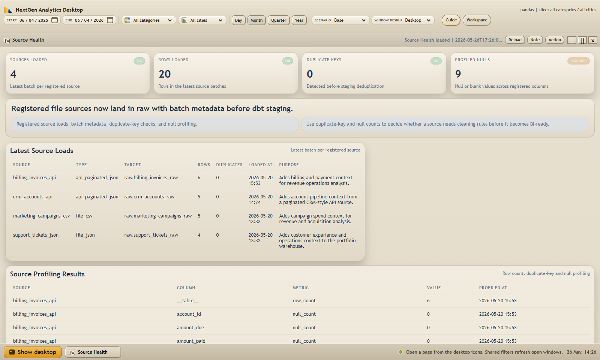
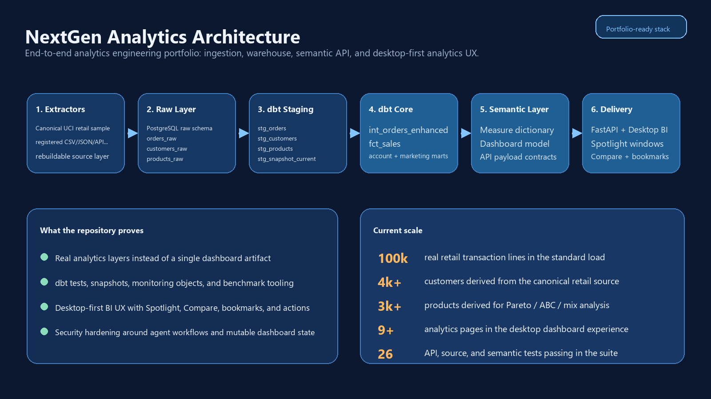
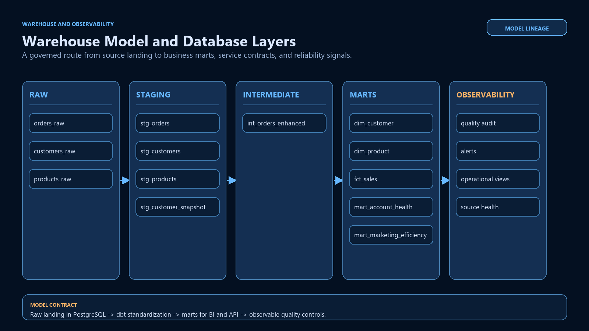

# Data Pipeline Portfolio

[English](./README.md) | [Portuguese](./README.pt.md)

[](https://github.com/victorn198/data-pipeline-portfolio/actions/workflows/quality.yml)


An end-to-end analytics platform that turns retail, CRM, billing, support, and
marketing signals into revenue, retention, and account-health decisions.

Built with `Python`, `PostgreSQL`, `dbt`, `FastAPI`, and a custom desktop BI
interface. The repository is a case study of the full analytics workflow, from
source ingestion through trusted business metrics and investigation-ready views.

> **Portfolio disclosure:** the ecommerce layer uses a public UCI Online Retail
> sample. CRM, billing, support, and marketing records are synthetic fixtures
> created for the case study. No client data is included.

**See it in action:** [90-second product walkthrough](./assets/gallery/nextgen-demo.webm) | [guided demo script](./docs/DEMO_SCRIPT.md)

## What This Proves

- `100,000` public retail transaction lines, with `4,151` customers and `3,379` products
- a governed `raw -> staging -> marts -> semantic API -> BI` workflow with dbt tests and snapshots
- business analysis for revenue, Pareto/ABC, RFM, retention, forecasting, source quality, and account health
- an investigation workflow that combines CRM, billing, support, and ecommerce signals into an actionable watchlist

## Product Walkthrough

### Account Health


The strongest business case: identify which accounts need attention, why they
need it, and what operational signal is driving the priority.

### Revenue and Product Decisions


Revenue, order volume, average ticket, and Pareto concentration are available
in one decision view rather than in disconnected dashboard pages.

### Source Health



The source layer makes load metadata, duplicate checks, and null profiling
visible before data is promoted into BI-ready models.

### Investigation Workflow


Short interaction preview: [nextgen-demo.webm](./assets/gallery/nextgen-demo.webm)


## Technical Scope

- registered CSV, JSON, and API-style source ingestion with load metadata and profiling
- dbt warehouse models, snapshots, data quality tests, and monitoring objects
- semantic KPI definitions and FastAPI delivery contracts
- a desktop-first analytics UX with drilldowns, comparisons, saved workspaces, and action follow-up

Account Health references:

- [Account Health Case Study](./docs/ACCOUNT_HEALTH_CASE_STUDY.md)
- [Demo Script](./docs/DEMO_SCRIPT.md)
- dbt mart: `dbtproject/models/marts/mart_account_health.sql`
- API endpoint: `GET /api/account-health`

## Architecture



## Warehouse View



The warehouse visual above is repository-derived, not a live PostgreSQL GUI
capture. That choice keeps the structure visible even when the local database
is offline.

## Analytics Methods Included

- aligned period-over-period comparisons
- net versus gross sales separation with cancellation visibility
- campaign spend, attributed revenue and `ROAS`
- Pareto and `ABC` concentration analysis
- `RFM` customer segmentation
- retention cohort analysis
- anomaly and structural shift detection
- predictive scenarios: `Base`, `Conservative`, `Upside`
- drilldowns from business slice to underlying members

## Product Features Included

- desktop-style navigation with windows and taskbar
- `Data Center` window with a connector library, source toggles, connection drafts, and no-code local CSV/JSON import analysis
- `Imported Dataset` preview window with quality cards, suggested mapping, auto view, column profile, and sample rows isolated from official KPIs
- `Spotlight` windows with local filters and frozen context
- `Compare` windows for side-by-side investigation
- `Bookmarks` to restore saved workspaces
- `Recent` activity and `Action Board`
- CSV export from detail and comparison views
- window design themes inside the desktop shell
- `Executive Scorecard` and `Marketing Efficiency` windows for certified KPI review and campaign ROAS analysis
- `Source Health` window for registered-source audit and profiling results
- `Account Health` window for company operations and customer risk follow-up

## Quick Start

### Prerequisites

- Python `3.10+`
- Docker Desktop or local PostgreSQL

### Windows: run the complete demo

```powershell
.\scripts\run-demo.ps1
```

The script creates the local virtual environment and dbt profile when missing,
starts PostgreSQL, loads the source data, builds and tests the warehouse, then
opens the Account Health walkthrough. On later runs, use `-SkipInstall` to skip
dependency installation.

### Manual run

```bash
cp .env.example .env
cp dbtproject/profiles.yml.example dbtproject/profiles.yml
python -m venv .venv
source .venv/bin/activate
python -m pip install --upgrade pip setuptools
pip install -r requirements.txt -c constraints.txt
docker compose up -d
python scripts/loadsampledata.py --mode full_refresh
python scripts/load_registered_sources.py
cd dbtproject
export DBT_PROFILES_DIR=$(pwd)
dbt deps
dbt run --full-refresh
dbt snapshot
dbt test
cd ..
python -m uvicorn nextgen_dashboard.backend.main:app --reload --port 8601
```

Open `http://127.0.0.1:8601`

## Quality and Security

```bash
./scripts/verify-portfolio.ps1
```

Add `-IncludeWarehouse` after a local demo setup to run dbt tests too.

Current hardening in the repo:

- explicit CORS origins
- agent mutations disabled by default
- token-gated mutations when enabled
- static asset allowlist
- atomic local writes for governed state

See:

- [AI Agent Security](./docs/AI_AGENT_SECURITY.md)
- [Quality Gates](./docs/QUALITY_GATES.md)
- [SECURITY.md](./SECURITY.md)

## AI Collaboration

I used AI during implementation and review, and I keep that explicit.

AI helped with:

- repetitive implementation work
- UI iteration
- refactoring and cleanup
- test expansion
- documentation drafting
- security review support

AI did not own product direction, business framing, acceptance criteria, or
final review. Those decisions remained manual.

More detail: [AI Collaboration Disclosure](./docs/AI_COLLABORATION_DISCLOSURE.md)

## Repository Guide

- `fivetran_simulator/`: ingestion simulators and scaled sample generation
- `fivetran_simulator/source_registry.yml`: governed file-source contracts
- `dbtproject/models/`: warehouse transformations
- `dbtproject/tests/`: SQL quality checks
- `nextgen_dashboard/`: FastAPI backend and desktop-first frontend
- `scripts/setup_*.sql`: monitoring and operational SQL objects
- `scripts/benchmark_dashboard.py`: dashboard performance regression check
- `assets/gallery/`: real project screenshots and demo captures
- `assets/diagrams/`: architecture and warehouse visuals

## Useful Docs

- [GitHub Repository Setup](./docs/GITHUB_REPOSITORY_SETUP.md)
- [Architecture](./docs/ARCHITECTURE.md)
- [Data Lineage](./docs/DATA_LINEAGE.md)
- [Multi-Source Analytics Roadmap](./docs/MULTI_SOURCE_ANALYTICS_ROADMAP.md)
- [Business Source Decision](./docs/BUSINESS_SOURCE_DECISION.md)
- [dbt Models](./docs/DBT_MODELS.md)
- [Measure Dictionary](./docs/MEASURE_DICTIONARY.md)
- [Predictive Outlook Method](./docs/PREDICTIVE_OUTLOOK_METHOD.md)
- [Statistical Analytics Stack](./docs/STATISTICAL_ANALYTICS_STACK.md)
