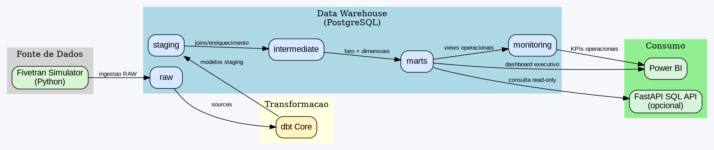

# Data Lineage e Arquitetura

Este documento descreve o fluxo de dados do projeto na arquitetura PostgreSQL.

## Diagrama (DOT)

## Fluxo resumido

1. `scripts/loadsampledata.py` e extratores em `fivetran_simulator/` carregam `raw.orders_raw`, `raw.customers_raw` e `raw.products_raw`.
2. dbt le as fontes RAW e materializa camadas `staging`, `intermediate` e `marts`.
3. Scripts SQL criam auditoria em `data_quality` e views de operacao em `monitoring`.
4. Power BI conecta no PostgreSQL e consome `marts` + `monitoring`.
5. API FastAPI (opcional) permite consultas SQL read-only para suporte de analise.
